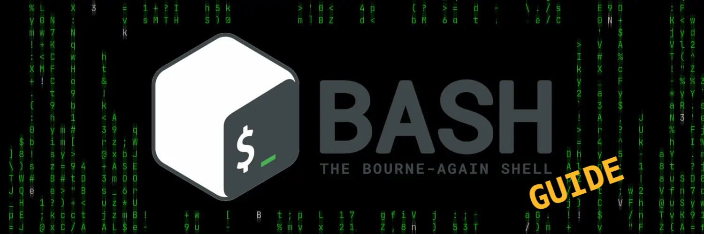

# Bash Guide

  
 <b>A guide with bash code examples</b>

This guide has been written with idea to provide a simple and clear concepts of bash coding for those who want to learn or just want a reminder / refresh on "how to do what". 

I hope this resource can be useful for someone, **enjoy**!

Available Languages
- [Italian - Italiano](README-it.md) 🇮🇹

Note: 
- The topics with 🚧 icon are under construction.
- This work is released under **[CC BY-NC 4.0 License](LICENSE.md)** 
- The [example scripts](scripts) are released under **[MIT License](scripts/LICENSE.md).**

 **Disclamer**: The information is provided for educational purposes. Although care has been taken to ensure the correctness of the contents, no guarantee is given as to their accuracy or suitability for a specific purpose. The author is not responsible for any damages resulting from the use of the information or code presented.

## Introduction
1. [What is Bash?](00-introduction/what-is-bash.md)
1. 🚧 [Basic Commands Crash Course](00-introduction/crash-course.md) 

## Basic Script
1. [Preparing the script file](01-basics/01_01-preparing-script-file.md)
1. [Variables](01-basics/01_02-variables.md)
1. [Special Variables](01-basics/01_03-special-variables.md)
1. [Read user input](01-basics/01_04-read-input.md)

## Flow Control
1. [Conditional Operators](02-flow-control/02_01-conditions.md)
1. [If](02-flow-control/02_02-if.md) 
1. [case](02-flow-control/02_03-case.md) 
1. 🚧 [Loops](work-in-progress.md) 
